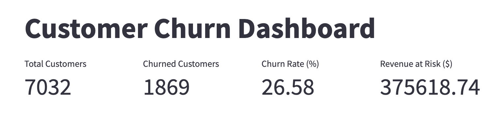
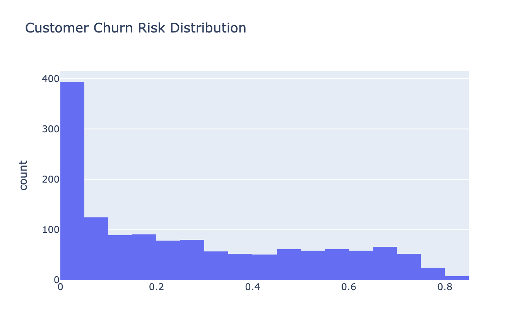

# Customer Churn & Retention Dashboard

## Business Problem
Customer churn directly impacts revenue and long-term growth.  
This project identifies customers at risk of churn and quantifies revenue exposure to support retention strategies.

## What I Built
- End-to-end churn prediction model (Logistic Regression)
- Executive KPI dashboard (customers, churn rate, revenue at risk)
- Customer-level churn risk scoring
- Interactive dashboard using Streamlit

## Key Insights
- ~26.6% churn rate across customer base
- High-risk churn segment identifiable via model probability
- Significant monthly revenue exposed to churn

## Tools & Techniques
- Python (pandas, scikit-learn)
- Logistic Regression
- Feature encoding & preprocessing
- Plotly for visualization
- Streamlit for dashboarding

## Output

